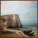
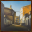
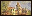
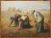
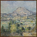
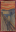
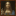

# The Vervada

[![Discord][img-discord]][url-discord]
[![GitHub][img-github]][url-github]  
[![Modrinth][img-modrinth]][url-modrinth]

The Vervada brings a medieval golden age feeling to your kingdoms and villages. Made for builders, The Vervada combines variants and simple, yet detailed 3d models to add realism, more life and more depth to your creations while keeping the charm of Minecraft's textures.

Download it on Modrinth [![Latest][img-latest]][url-latest]

## Noteworthy features

- Randomized blocks
  - Randomized flower and flowers pots
  - Fully randomized bookshelves
- 3D vegetables and crops, also available as a [separate ressource pack.](https://www.urbandictionary.com/define.php?term=soon%20%28tm%29)
  - Bushy leaves
  - 3D crops
- Custom models
  - Models for all doors and trapdoors
  - Realistic rails
- Revamped GUI
  - Sleek Hotbar & Icons
  - Themed GUI
- New blocks using double slabs also available as a [separate ressource pack.](https://modrinth.com/resourcepack/rgb-texture-pack)

### Specials features

- 3D models / variants for most of entities
- connected textures
- customs barrel textures ( rename a barrel Barrel of wheat / gold / iron / copper / fish / coal )

Use Fabulously Optimized to access those feature, get it here : [download.fo](download.fo).

### Gallery

More images on [Modrinth](https://modrinth.com/resourcepack/the-vervada/gallery).

## Specials thanks & credits

- Lead Artist : Valdr687
- With help from :
  - MicrowaveIsMe : 3D Models
  - [\_victor.blanc_](https://www.instagram.com/_victor.blanc_/) : Custom paintings

## License

This work is licensed under a Creative Commons Attribution-NonCommercial-NoDerivatives 4.0 International License.  
Paintings belong to public domain, but this may vary depending on the region/artist.

___

## Painting Collection

|Vanilla Name|Title|Artist|Image|
|-:|-:|-:|-:|
|Aztec|_M. DEUTSCH'S AIRSHIP "LA VILLE DE PARIS"_|Raphael Tuck & sons||
|Burning skull|_La Falaise d’Étretat après l'orage_|Gustave Courbet||
|Bust|_Calle Martinez Anido_|Daniel Belin||
|Courbet|_Jardin_|Claude Monet||
|Creebet|_Le Pont aux Anglais_|Robert Antoine Pinchon||
|Donkey Kong|_Des Glaneuses_|Jean-François Millet||
|Fighters|_Battle of the combined Venetian and Dutch fleets against the Turks in the Bay of Foja_|Abraham Beerstratenm||
|Graham|_American Gothic_|Grant DeVolson Wood||
|Pigscene|_Impression soleil levant_|Claude Monet||
|Plant|_The Money Changer and His Wife ( detail )_|Quentin Matsys||
|Pointer|_Montagne Sainte Victoire_|Paul Cézanne||
|Pool|_La torre de Hercules_|Picasso||
|Sea|_Vanité_|Philippe de Champaigne||
|Skeleton|_Entree du port de La Rochelle_|Paul Signac||
|Skull and roses|_IKeelmen Heaving in Coals by Moonlight_|Joseph Mallord William Turner||
|Stage|_Boats at Harbor Dock_|Willam Sherman||
|Sunset|_Pirates' Haunt_|Montague Dawson||
|Void|_White Water Lilies_|Claude Monet||
|Wanderer|_The scream_|Edvard Munch||
|Wasteland|_Salvator Mundi_|Leonardo da Vinci||
|Wither|_Le seul oiseau qui vole au dessus des nuages_|André Devambez||

___

## Changelog 7: Update #6

### Patchs

- Patched glitchy texture of loom

## Changelog 6: Update #5

- Added cherry doors and cherry trapdoors
- Added cherry fence and cherry fence gate
- Added cherry logs and double slabs
- Added pink petals and cherry leaves
- Added torchflower and torchflower
- Added pitcher plant and pitcher crops
- Added cherry sapling

## Changelog 5: Update #4

- Updated pack version
- Added custom seagrass including several variants
- Added cattails (feature exclusive to Optifine or to [Fabulously Optimized](https://modrinth.com/modpack/fabulously-optimized))
- 3D models now use cullface which allowed an huge fps boost (+2000% on my computer)
- Deleted vines and glow lichen due to game side issues
- Fixed broken path and gui
- Added stonecutter

## Changelog 4 : Minor patches and upgrades

- Fixed smooth quartz double slabs & quartz double slabs
- Improved ( red ) sandstone double slabs

## Changelog 3 : Update #3

- Added connected texture for grass block, sand, red sand, gravel, dirt, coarse dirt, concretes, terracotta, sandstone, red sandstone,.
- Various bug patchs
- Added custom gui for containers and achievements
- Added bamboo trapdoors
- Added bamboo planks / bamboo mosaic double slabs
- Added bamboo doors
- Added chiselled bookshelf

## Changelog 2 : Update #2

- Optimized all 3D models
- added frogspawn
- added goat horn

## Changelog 1 : Update #1

- patched cartography table / ores / crafting table / pumpkin / fletching table
- patched pressure plates interacting with others 3d models
- bushy leaves are now in another addon, with more optimized model ( on discord)
- created a lighter version without the most common blocks ( on discord too )

<!-- URLs -->

[img-discord]: <https://img.shields.io/badge/Discord-5865F2?style=for-the-badge&logo=discord&logoColor=white>
[img-github]: <https://img.shields.io/badge/GitHub-100000?style=for-the-badge&logo=github&logoColor=white>
[img-modrinth]: <https://img.shields.io/modrinth/dt/4Dg1DEy1?style=for-the-badge>
[img-latest]: <https://img.shields.io/modrinth/v/4Dg1DEy1?style=for-the-badge&logo=Modrinth>

[url-github]: <https://github.com/Valdr687/vervada>
[url-discord]: <https://discord.com/invite/rKgAg8X>
[url-modrinth]: <https://modrinth.com/resourcepack/the-vervada>
[url-latest]: <https://modrinth.com/resourcepack/the-vervada/versions>
